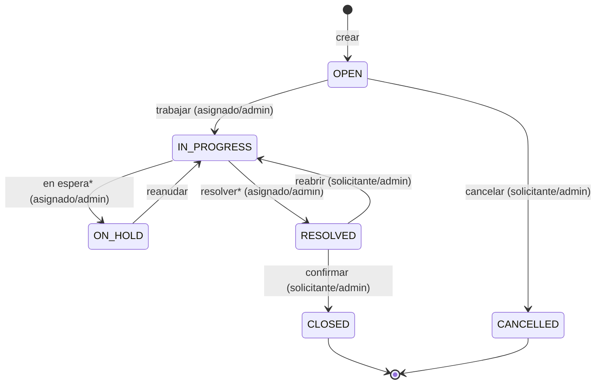
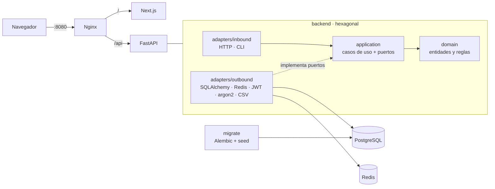

# Helpdesk TI

Sistema de seguimiento de tickets de trabajo de TI. El backend está en **Python (FastAPI) con arquitectura hexagonal** y el frontend en **Next.js**. La autenticación usa **JWT con refresh tokens rotativos**, los permisos son **RBAC escalable**, hay **bitácora de auditoría** y **dashboard analítico**, y todo corre en **Docker**.

## Arranque rápido

Requisitos: Docker Desktop (o Docker Engine con Compose v2).

```bash
cp .env.example .env
docker compose up --build
```

Abre **http://localhost:8080**. Al arrancar se aplican las migraciones y se cargan los datos de ejemplo: 3 usuarios demo, técnicos y unos 200 tickets repartidos en 60 días, para que el dashboard tenga datos.

| Rol | Correo | Contraseña (en `.env`) |
|---|---|---|
| admin | `admin@helpdesk.test` | `SEED_ADMIN_PASSWORD` |
| usuario | `usuario@helpdesk.test` | `SEED_USER_PASSWORD` |
| observador | `observador@helpdesk.test` | `SEED_OBSERVER_PASSWORD` |

- Documentación interactiva de la API: http://localhost:8080/api/docs
- Desarrollo con recarga en caliente: `docker compose -f compose.yaml -f compose.dev.yaml up --build` (o `make dev`)

## Qué incluye

| Requisito | Implementación |
|---|---|
| Logging | Logs estructurados en JSON (structlog) con `request_id` que viaja de Nginx a la API. Además, una bitácora en BD de **inicios de sesión** (exitosos y fallidos, con motivo, IP y navegador) y de **auditoría** (quién hizo qué y sobre qué entidad). Ambas se consultan en pantalla y se exportan a CSV. |
| Roles (3 y escalables) | `admin`, `usuario` y `observador` vienen precargados. La autorización se evalúa **por permiso**, nunca por nombre de rol. En *Roles y permisos* el admin crea roles nuevos marcando permisos y funcionan sin tocar código. |
| Pantallas por rol | El menú se arma según los permisos; hay insignia de rol, banner de "solo lectura" y guardas por pantalla. El backend vuelve a validar cada petición. |
| Crear tickets (excepto observador) | Permiso `tickets:create`. El observador no lo tiene: no ve el botón y la API responde 403. |
| Flujo de ≥ 4 estatus | Abierto, En progreso, En espera, Resuelto, Cerrado y Cancelado, con máquina de estados en el dominio (ver abajo). |
| Lista analítica / dashboard | Lista con filtros en la URL, búsqueda, orden y paginación en servidor. Dashboard con KPIs, SLA, MTTR, tendencia, distribución por estatus, prioridad y categoría, antigüedad del backlog y top de asignados. |
| Admin de usuarios | Alta, edición, cambio de rol, activación y desactivación (revoca sesiones) y restablecimiento de contraseña. |
| Exportación CSV | Tickets (respeta los filtros), usuarios, inicios de sesión y auditoría. Se genera en streaming, con BOM UTF-8 para Excel y protección contra *CSV injection*. |
| Docker | Imágenes multi-stage con usuario no root y healthchecks. Compose incluye un job de migraciones, Nginx como reverse proxy y un overlay de desarrollo. |
| Una sola pestaña (observador) | Se valida en el navegador (Web Locks) y en el servidor (lease en Redis), con botón **"Usar aquí"**. Ver [ADR 0003](docs/adr/0003-una-sola-pestana.md). |
| Python + JWT + migraciones | FastAPI, access JWT de 15 min en memoria, refresh token rotativo en cookie httpOnly y Alembic ejecutado por un servicio `migrate`. |
| Arquitectura hexagonal | `domain` → `application` (puertos y casos de uso) → `adapters` (entrada y salida). El CI hace cumplir las capas con **import-linter**. |

### Flujo de estatus


\* Requiere comentario. El SLA se calcula por prioridad (Crítica 4 h, Alta 8 h, Media 24 h, Baja 72 h; configurable en `.env`).

### Roles precargados

| Permiso | admin | usuario | observador |
|---|:-:|:-:|:-:|
| Crear tickets | ✔ | ✔ | |
| Ver tickets propios / asignados | ✔ | ✔ | |
| Ver todos los tickets | ✔ | | ✔ |
| Atender tickets asignados | ✔ | ✔ | |
| Administrar tickets (asignar, mover cualquiera) | ✔ | | |
| Comentar | ✔ | ✔ | |
| Dashboard | ✔ | ✔ (alcance propio) | ✔ |
| Exportar CSV | ✔ | ✔ (alcance propio) | ✔ |
| Usuarios / Roles / Bitácora | ✔ | | |
| Una sola pestaña y sesión | | | ✔ |

## Arquitectura



```
backend/src/helpdesk/
  domain/        Ticket (máquina de estados, SLA), User/Role/Permission, sesiones, auditoría
  application/   ports.py (interfaces), use_cases/ (auth, tickets, users, roles, dashboard, logs)
  adapters/
    inbound/     http/ (FastAPI: routers, schemas, deps, errores, middleware) · cli/ (seed)
    outbound/    persistence/ (SQLAlchemy: repos, consultas, analítica, UoW) · redis · security · csv · logging
  container.py   composition root (el único que conoce las implementaciones)
frontend/src/
  app/           rutas (App Router) · (app)/ protegido por sesión y por la regla de pestaña única
  features/      auth, single-tab, tickets, dashboard
  lib/api/       cliente tipado generado desde el OpenAPI del backend
```

Decisiones documentadas en [`docs/adr`](docs/adr).

## Pruebas y calidad

| Qué | Comando |
|---|---|
| Unitarias del backend (dominio y casos de uso con fakes en memoria, sin BD) | `cd backend && uv run pytest tests/unit` |
| API end-to-end con Postgres y Redis reales (incluye migraciones up, down, up) | `make test-api` |
| Lint, formato, mypy strict y contratos hexagonales | `make lint` |
| Front: lint, tipos, Vitest y build | `cd frontend && npm run lint && npm run typecheck && npm test && npm run build` |
| E2E con Playwright contra el stack (incluye el caso de dos pestañas) | `make e2e` |

## CI/CD

Ver [ADR 0005](docs/adr/0005-ci-cd.md) para la propuesta completa y el roadmap.

- **`ci.yml`** (en cada PR):
  - backend: ruff, mypy, import-linter, pytest con Postgres y Redis como servicios, cobertura ≥ 80 % y `alembic check`;
  - frontend: lint, tipos, Vitest y build;
  - e2e: `docker compose up --wait` y Playwright;
  - seguridad: gitleaks, pip-audit, npm audit y Trivy sobre las imágenes.
- **`cd.yml`**:
  - en `main`: imágenes a **GHCR** (con SBOM y provenance) y deploy automático a **staging**;
  - en un tag `v*`: deploy a **producción** con aprobación manual (GitHub Environments).
  - El deploy corre `migrate` antes de actualizar la app.

## Variables de entorno

Todas están documentadas en [`.env.example`](.env.example). En producción: `COOKIE_SECURE=true`, un `JWT_SECRET` propio, `SEED_DEMO_DATA=false` y `APP_ENV=prod`. Con `APP_ENV=prod` se desactiva `/api/docs`.
