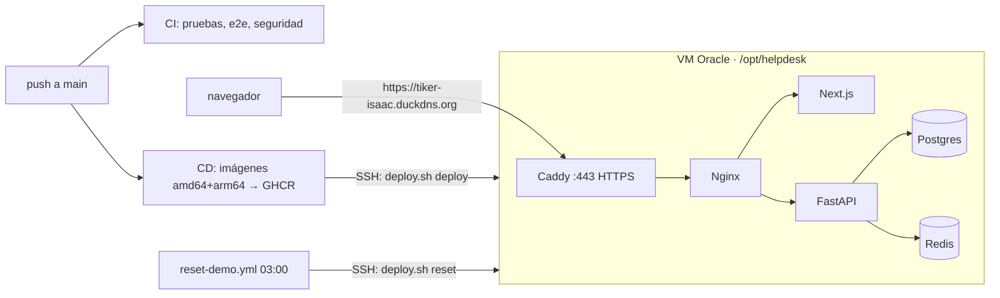

# Demo en Oracle Cloud (Always Free) con despliegue desde GitHub Actions

Costo: $0. Oracle Cloud Always Free (VM ARM), DuckDNS (subdominio), Let's Encrypt (certificado vía Caddy),
GitHub Actions y GHCR (repo público).



## 1. Oracle Cloud

1. **Red.** *Networking → Set up a network with a wizard → Create VCN with Internet Connectivity*
   (`ticker-vcn`, resto por defecto).
2. **Puertos.** *VCN → Subnets → public subnet → Security → Default Security List → Add Ingress Rules*:
   dos reglas TCP desde `0.0.0.0/0` a los puertos **80** y **443** (el 22 ya viene abierto).
3. **VM.** *Compute → Create instance*:
   - Shape: *Ampere* → `VM.Standard.A1.Flex`, 2 OCPU / 12 GB (entra en Always Free; con 1 OCPU / 6 GB también corre).
   - Imagen: Canonical Ubuntu 24.04.
   - Red: `ticker-vcn`, subnet pública, con IPv4 pública.
   - SSH: *Generate a key pair for me* y descarga la llave privada (única copia).
   - Si aparece *Out of capacity*, reintenta más tarde o con menos OCPU.
4. **IP fija.** *Instancia → VNIC → IP administration → Edit* → *Reserved public IP* (crear nueva).

## 2. DuckDNS

En [duckdns.org](https://www.duckdns.org), apunta el subdominio a la IP pública de la VM (*update ip*).
El token de DuckDNS no se usa en este flujo: la IP reservada no cambia.

## 3. Preparar la VM (una sola vez)

```bash
ssh -i ~/.ssh/ticker-oracle.key ubuntu@IP_DE_LA_VM
curl -fsSL https://raw.githubusercontent.com/Isaac-syc/TICKER/main/infra/deploy/bootstrap-vm.sh \
  | sudo bash -s -- tiker-isaac.duckdns.org
```

[`bootstrap-vm.sh`](../infra/deploy/bootstrap-vm.sh):
- actualiza el sistema y abre 80/443 en el `iptables` de la VM (la imagen de Oracle rechaza todo salvo SSH);
- instala Docker Engine + Compose desde el repo oficial, con rotación de logs;
- crea `/opt/helpdesk/.env` con secretos aleatorios (`APP_ENV=prod`, `COOKIE_SECURE=true`, contraseña de BD,
  `JWT_SECRET`) y contraseñas demo, que deja en `/opt/helpdesk/credenciales-demo.txt`.

Es idempotente: si se vuelve a correr, no toca el `.env` existente.

## 4. GitHub

*Settings → Secrets and variables → Actions*:

| Tipo | Nombre | Valor |
|---|---|---|
| Secret | `STAGING_SSH_KEY` | contenido completo de la llave privada de la VM |
| Secret | `STAGING_HOST` | `ubuntu@IP_DE_LA_VM` |
| Variable (de repositorio) | `STAGING_URL` | `https://tiker-isaac.duckdns.org` |

`STAGING_URL` debe ser variable **de repositorio**, no de environment: los jobs la leen en su `if:`, que se
evalúa antes de entrar al environment. Mientras no exista, CD solo publica imágenes y el reset no corre.

Primer despliegue: *Actions → CD → Run workflow* (o cualquier push a `main`).

## Qué hace cada despliegue

[`deploy.sh deploy`](../infra/deploy/deploy.sh):
1. Copia `compose.yaml`, `compose.prod.yaml`, `infra/nginx` e `infra/caddy` a `/opt/helpdesk` (la VM no clona el repo).
2. Fija `REGISTRY`/`TAG` en el `.env` al SHA recién construido (imagen inmutable, rollback = redeploy de un SHA anterior).
3. `compose pull` → `run migrate` (si las migraciones fallan, la versión anterior sigue sirviendo) → `up -d --wait`.
4. El workflow termina con un smoke test a `/api/health/ready` por HTTPS.

`deploy.sh reset` (workflow nocturno o manual): detiene la API, `alembic downgrade base`, migra, resiembra,
limpia Redis y levanta todo de nuevo.

## Operación en la VM

```bash
cd /opt/helpdesk
docker compose ps                 # estado (el .env ya incluye compose.prod.yaml)
docker compose logs -f api        # logs JSON de la API
cat credenciales-demo.txt         # usuarios demo
```

## Acceso a la base de datos (HeidiSQL, DBeaver, psql)

Postgres solo escucha en `127.0.0.1:5432` de la VM (nunca en internet). Se entra con un túnel SSH:

```bash
ssh -i ~/.ssh/ticker-admin -N -L 5433:127.0.0.1:5432 ubuntu@IP_DE_LA_VM
```

y el cliente se conecta a `127.0.0.1:5433`, base `helpdesk`, usuario `helpdesk`. La contraseña está en
`POSTGRES_PASSWORD` de `/opt/helpdesk/.env`. HeidiSQL también puede abrir el túnel solo (pestaña *SSH tunnel*).

## Notas

- **HTTPS es obligatorio**: la cookie del refresh token es `Secure`; Caddy obtiene y renueva el certificado solo.
- **IP real del cliente**: Caddy pone `X-Forwarded-For` y Nginx solo confía en la IP fija de Caddy
  (`TRUSTED_PROXY_CIDR`); así el rate limit de login y la bitácora registran la IP del visitante.
- **API docs**: con `APP_ENV=prod`, `/api/docs` está desactivado; en local sigue disponible.
- GitHub pausa los workflows programados tras 60 días sin actividad en el repo.
